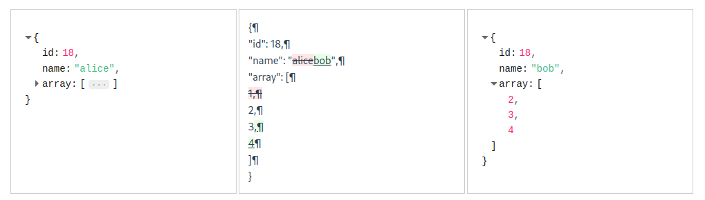

# vue3-json-diff

# example effect/效果


# Install/安装
```
npm install --save vue3-json-diff
```

# Usage/用法
```html
<script setup lang="ts">
  import {ref} from "vue"
  import Vue3JsonDiff from "vue3-json-diff"
  import "vue3-json-diff/dist/style.css"
  const left_data = ref({
    id: 18,
    name: "alice",
  })
  const right_data = ref({
    id: 18,
    name: "bob",
  })
</script>

<template>
  <main>
    <div style="width: 900px">
      <Vue3JsonDiff
          :left-value="left_data"
          :right-value="right_data"
      />
    </div>
  </main>
</template>
```
